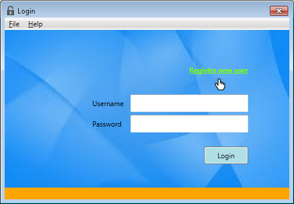
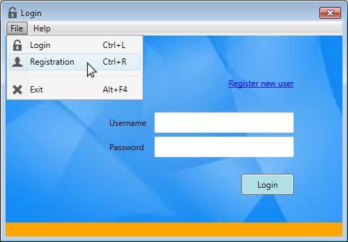
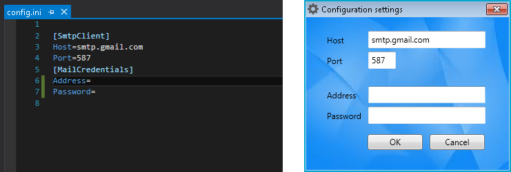
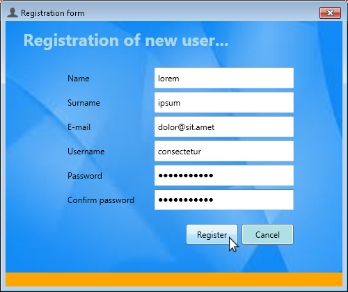
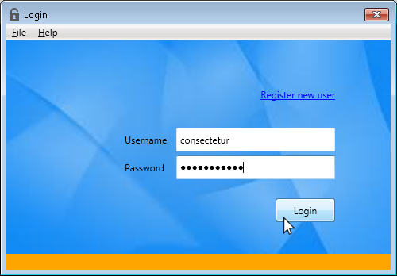
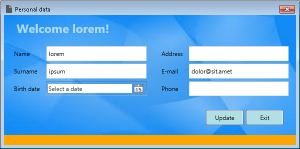

# Registration Form #

Registration Form is a simple demo program for user registration, authentication 
and profile managment. Microsoft SQL Server is selected as RDBMS of choice.

### Details ###

This program consists of several parts:

- Registration of a new account.
- Authentication.
- Own profile management.

#### Configuration settings ####

New user will get an email notification about successful registration, if SMTP client 
and email credentials were specified in config.ini file.

#### Registration of a new account ####

New users should register in order to be able to log into the system.

After submitting the registration form, user gets an email notification.

#### Authentication ####

Registered users provide their authentication credentials (username and password) in
order to be able to log into the system.

#### Own profile management ####

After successfully logging in, registered users can view and/or modify their personal 
data such as name, surname, birth date, address etc.

### Software requirements ###

Microsoft SQL Server 2014 Express

### Why I wrote this app? ###

I have been "away" from programming for a while, due to several factors and reasons, such 
as (1) birth of my son (who is almost 5 years old now), (2) moving to a new country, 
(3) learning a new (Dutch) language and studying for obligatory integration exams. 

At the moment I'm "refreshing" my knowledge and skills. Writing apps like this seems 
the best way to do so.

I have a bachelor degree in Software Engineering, Master's degree in Information 
Technologies and work experience using C#/.NET, Adobe LifeCycle and JavaScript. 
See my CV for a full list of my knowledge set and skills.

If you are a company looking for (female) developers in Groningen area (the Netherlands), 
do not hesitate to [contact me](mailto:anahit.gardishyan@gmail.com).

### How to run? ###

See the Release directory for the release version.

### How to use the program? ###

*  Setup config.ini file (specify SMTP client and e-mail credentials)
*  Start up the program
*  If you are a new user, register yourself
*  If you are a previously registered user, use your credentials to log into your personal data
*  Edit your data
*  Update changes
*  Exit

### Screen shots ###

**Main application screen**

**File menu**

**Configuration settings**

**Registration of new user**

**Logging in**

**Personal data**

### License ###

[MIT License](LICENSE.txt)

### Author ###

Anahit Gardishyan [anahit.gardishyan@gmail.com](mailto:anahit.gardishyan@gmail.com)
